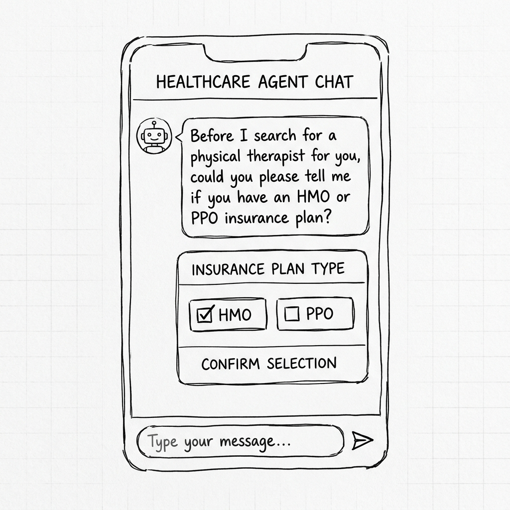
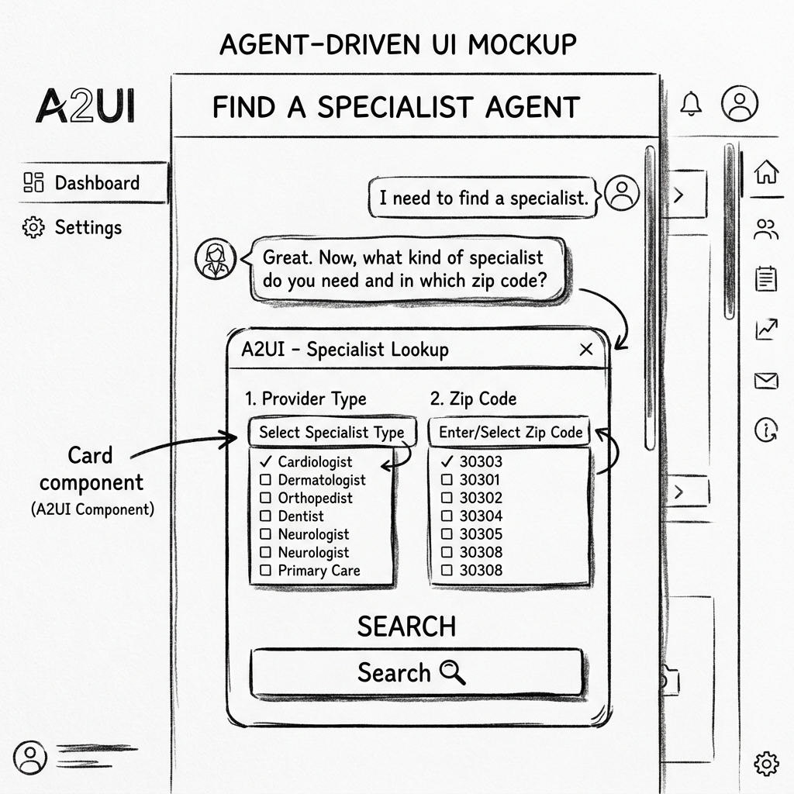
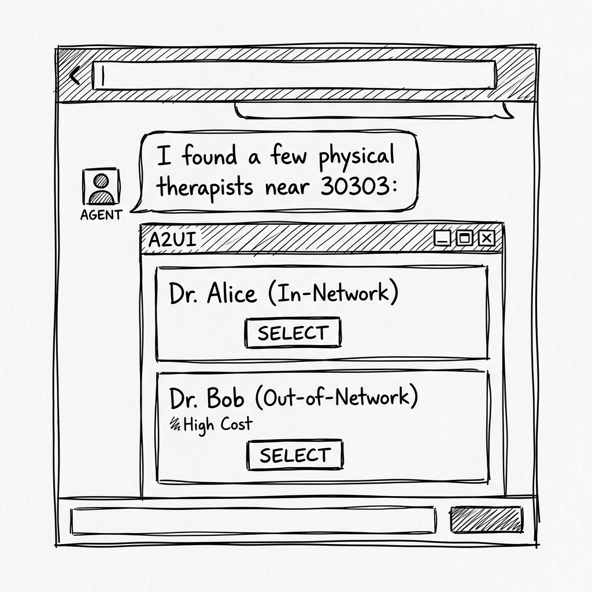
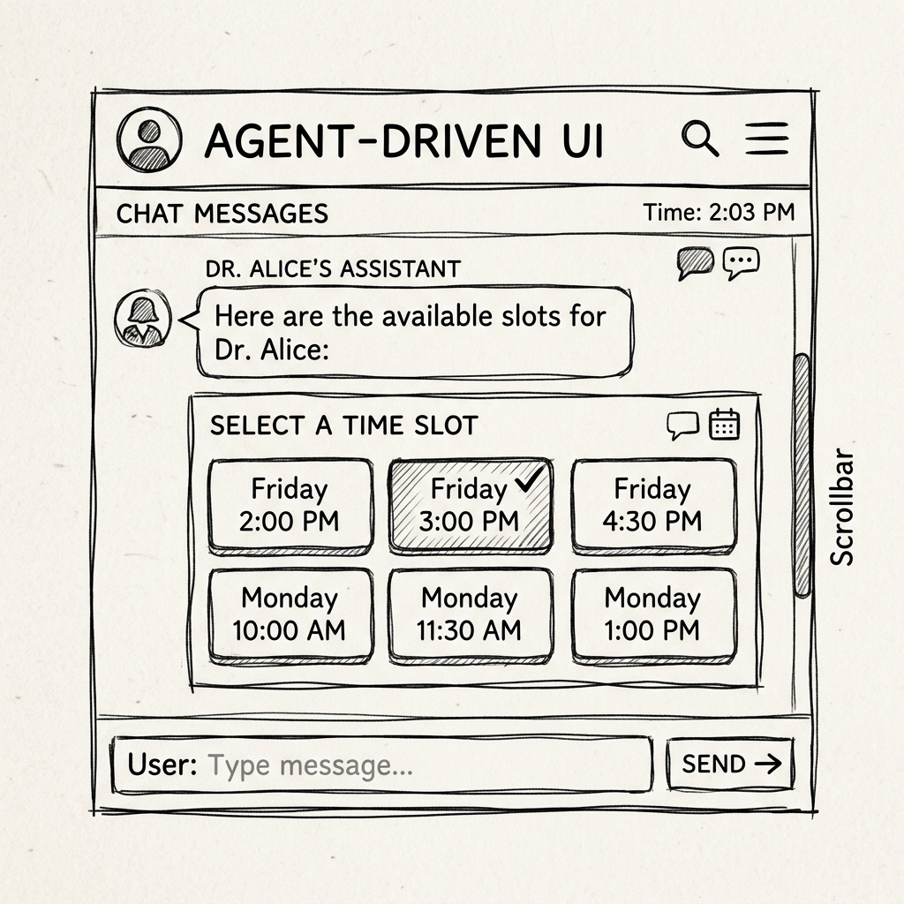
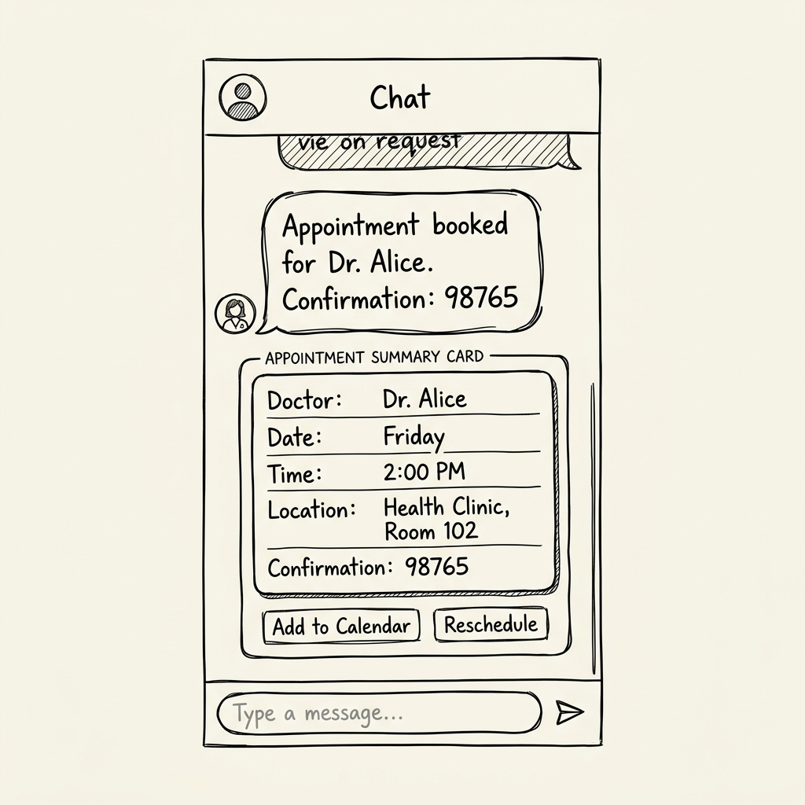

# CareConnect Navigator - A2UI UX Design

This document outlines the UX design for the `careconnect_navigator` agent, transformed into an Agent-Driven User Interface (A2UI).

## Goal
Enable users to find in-network physical therapists, check availability, and book appointments with clear visibility of network status and costs, reducing friction and typing.

## Flow Breakdown

### Step 1: Plan Selection
*   **User Intent**: Start the search.
*   **Agent Response**: "Hello! I'm CareConnect Navigator... Before we begin, could you please tell me if you have an HMO or PPO insurance plan?"
*   **A2UI Component**: `MultipleChoice`
    *   Options: `["HMO", "PPO"]`
*   **Rationale**: Prevents invalid inputs and speeds up the conversation.
*   **Wireframe**: 

### Step 2: Search Criteria Selection
*   **User Intent**: Specify provider type and location.
*   **Agent Response**: "Great. Now, what kind of specialist do you need and in which zip code?"
*   **A2UI Component**: `Card` containing:
    *   `MultipleChoice` (or Dropdown) for **Provider Type** (Options: Physical Therapist, Dermatologist, Cardiologist, Primary Care).
    *   `MultipleChoice` (or Dropdown) for **Zip Code** (Options: 30303, 30301, 30305, 30022, 30062).
    *   `Button`: "Search".
*   **Rationale**: Provides structure for the search. Since the list of supported zip codes is limited, making them selectable further reduces typing and prevents out-of-area searches.
*   **Wireframe**: 

### Step 3: Provider Selection
*   **User Intent**: View search results and select a provider.
*   **Agent Response**: "I found a few providers matching your criteria:"
*   **A2UI Component**: `Column` containing `Card`s.
    *   Each card displays:
        *   `Text`: Provider Name.
        *   `Text`: Network Status (In-Network / Out-of-Network).
        *   `Text`: Financial Warning (if Out-of-Network).
        *   `Button`: "Select & Check Availability".
*   **Rationale**: Visual grouping of provider details makes comparison easy.
*   **Wireframe**: 

### Step 4: Slot Selection
*   **User Intent**: Select a provider to check availability.
*   **Agent Response**: "Here are the available slots for [Provider Name]:"
*   **A2UI Component**: `MultipleChoice` or grid of `Button`s.
    *   Options: List of available time slots returned by the availability tool.
*   **Rationale**: Avoids asking the user to type a date/time, preventing scheduling errors.
*   **Wireframe**: 

### Step 5: Confirmation
*   **User Intent**: Select a slot and confirm booking.
*   **Agent Response**: "Appointment booked for [Provider Name]. Confirmation: [ID]"
*   **A2UI Component**: `Card`
    *   Displays summary of the appointment (Doctor, Date, Time, Confirmation ID).
*   **Rationale**: Provides a clear, non-ephemeral summary of the action taken.
*   **Wireframe**: 

## State/Data Requirements
*   `plan_type`: String (HMO or PPO).
*   `provider_type`: String.
*   `zip_code`: String.
*   `selected_provider_id`: String.
*   `selected_slot`: String.

## Design Principles Applied
*   **Simplicity First**: Minimized text input in favor of structured selection.
*   **Explicit Summaries**: Final step provides a clear summary card.
*   **Visual Grouping**: Used cards to group provider details.
