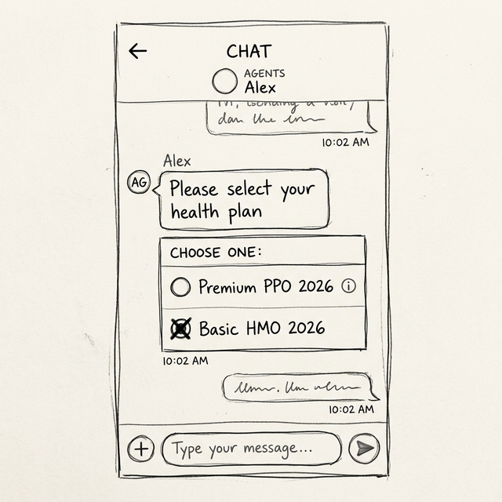
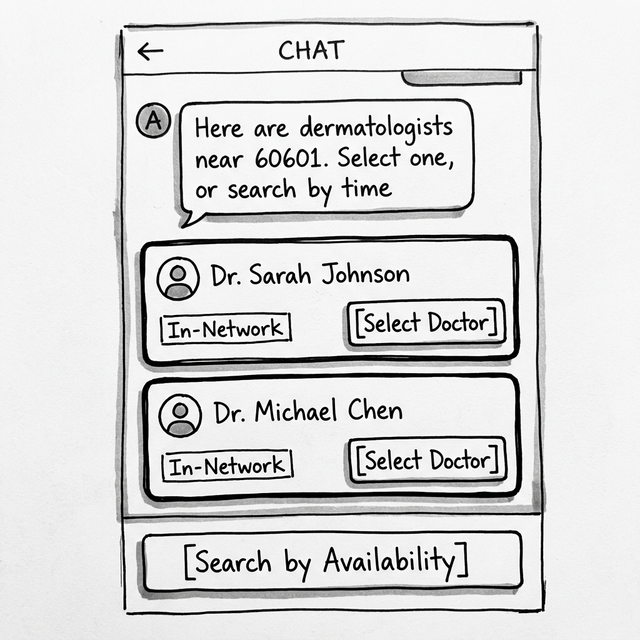
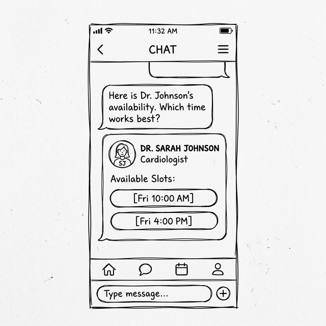
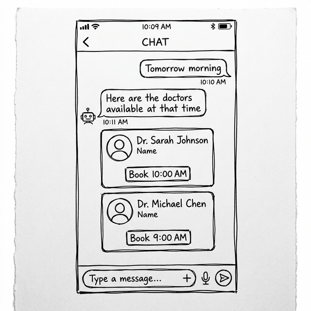
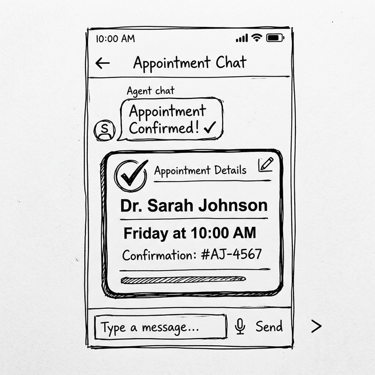

# CareConnect Navigator - A2UI UX Design Document

## 1. Goal
To design a seamless, structured interactive UI flow for the `careconnect_navigator_a2ui` agent using the A2UI framework. The goal is to reduce conversational friction by replacing text interactions with clickable, structured components while allowing multiple pathways for the user to select their desired doctor (e.g., based on location, network status, or specific availability).

## 2. Interaction Flow & Component Selection

Based on the established flow of the agent, here is the breakdown of the user intent, agent response, and the recommended A2UI components for each step.

### Step 1: Health Plan Selection

*   **User Intent**: The user initiates a search (e.g., "I need a Dermatologist near 60601").
*   **Agent Dialogue**: "To find the right doctors for you, I need to know your health plan. Please select your current plan from the options below:"
*   **A2UI Selection**: `MultipleChoice`
*   **UX Rationale**: Relying on the user to accurately type "premium_ppo_2026" is highly error-prone. A `MultipleChoice` radio button list guarantees a valid selection and reduces typing effort to a single click. 

### Step 2: Provider Search Results & Pathway Choice

*   **User Intent**: User selects their plan. They want to see doctors and decide how to proceed (by picking a specific doctor, or filtering by a specific time).
*   **Agent Dialogue**: "Here are dermatologists near 60601. You can select a specific doctor to see their schedule, or if you are in a hurry, we can search by your preferred time."
*   **A2UI Selection**: A vertical `Column` containing multiple `Card` components for each doctor (with a `[Select Doctor]` button), followed by a standalone `Button` for `[Search by Availability]`.
*   **UX Rationale**: Querying availability for every doctor simultaneously is too expensive. Instead, we display the list of doctors with their network status. We provide two explicit interactive pathways: 
    1. A button on each doctor's card to proceed with that specific doctor.
    2. A global button below the list to pivot the conversation to a time-first search.

---

### Step 3: Availability Verification (Branching)

*   **User Intent**:
    *   *Path A*: User clicked `[Select Doctor]`. They now need to pick a time.
    *   *Path B*: User clicked `[Search by Availability]`. They need to provide a time, and the agent must return doctors available *then*.
*   **Agent Dialogue**: 
    *   *Path A*: "Here is Dr. Johnson's availability. Which time works best?"
    *   *Path B*: "What day or time were you hoping to get an appointment? (e.g., 'Tomorrow morning' or 'Friday at 10 AM')" -> (User responds) -> "Here are the doctors available at that time."
*   **A2UI Selection**: 
    *   *Path A*: A single `Card` for the chosen doctor, containing a `Row` of `Button`s for their available time slots (e.g., `[Fri 10:00 AM]`, `[Fri 4:00 PM]`).
    *   *Path B*: A vertical `Column` containing multiple `Card` components. Each card represents a different doctor who has an opening at the requested time, with a single `[Book This Time]` button inside the card.
*   **UX Rationale**: By branching the flow, we satisfy both user journeys efficiently. 
    *   Path A is a drill-down: the user has chosen the resource (Doctor), now they just need to pick from the resource's inventory (Time). Showing the times as direct `Button`s eliminates typing.
    *   Path B is an inverted search: the user provides the constraint (Time) conversationally, and the UI presents the matching resources (Doctors). 

*   **Backend Refactoring Note**: To support *Path B*, the backend `search_providers` tool MUST be refactored to accept an optional `preferred_time` parameter. If provided, the tool should filter the returning doctors to only those who have availability matching that string inside `MOCK_AVAILABILITY`.

**Path A (Select Doctor) Wireframe:**

**Path B (Search by Time) Wireframe:**

---

### Step 4: Booking Confirmation

*   **User Intent**: User clicks a specific time slot button.
*   **Agent Dialogue**: "Great, you're all set! Your appointment has been booked."
*   **A2UI Selection**: A single, prominent `Card` component for the receipt.
*   **UX Rationale**: The confirmation requires a clear, standalone summary. A `Card` provides a visual anchor that the transaction is complete, displaying the Doctor's name, Date/Time, and the Confirmation Number all in one easily readable box that mimics a physical card or calendar event.

## 3. Implementation Notes for the Developer
*   **Agent Instruction Updates**: The agent must be instructed to proactively run the `get_availability` tool for the providers it finds *before* rendering the response to the user, allowing it to populate the integrated availability cards.
*   **Mandatory Unique IDs**: When implementing the Provider list, ensure each `Card` and its nested `Button` has a unique `id` (e.g., based on the `provider_id` + `timeslot`) so the action handler knows exactly which doctor and time the user clicked.
*   **Data Models**: The backend tools will need to be updated to return the raw data objects (not just formatted strings) so the A2UI components can bind directly to fields.
